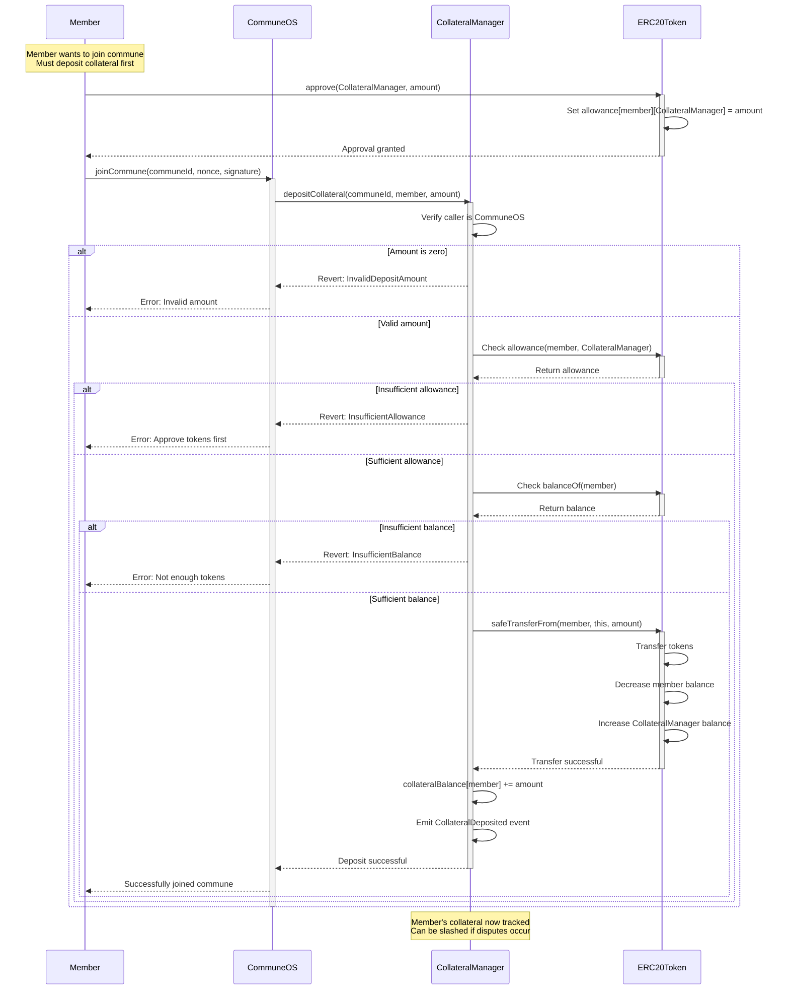
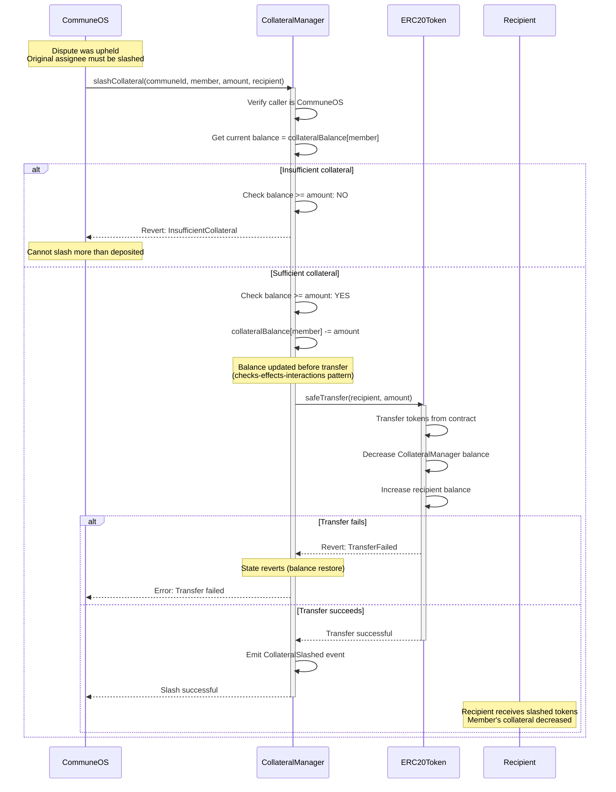
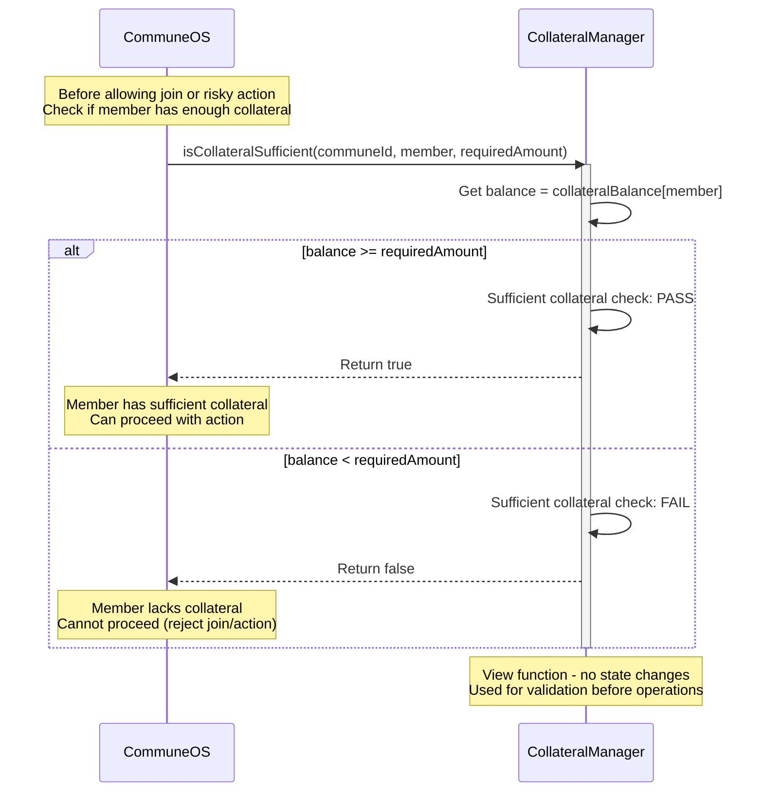
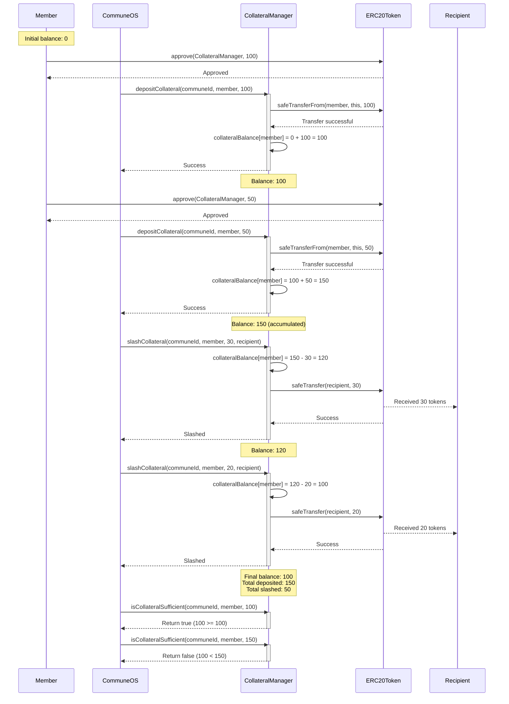

# CollateralManager Contract Test Suite

## Test Structure

```
CollateralManager Tests
├── Unit Tests
│   ├── Constructor
│   │   ├── test_constructor_withERC20Token
│   │   ├── test_constructor_withNativeETH
│   │   ├── test_constructor_setsUseERC20Flag
│   │   └── test_constructor_setsCollateralToken
│   │
│   ├── depositCollateral (ERC20)
│   │   ├── test_depositCollateral_ERC20_success
│   │   ├── test_depositCollateral_ERC20_transfersTokens
│   │   ├── test_depositCollateral_ERC20_updatesBalance
│   │   ├── test_depositCollateral_ERC20_emitsEvent
│   │   ├── test_depositCollateral_ERC20_revertsWithZeroAmount
│   │   ├── test_depositCollateral_ERC20_revertsWithInsufficientAllowance
│   │   ├── test_depositCollateral_ERC20_revertsWithInsufficientBalance
│   │   └── test_depositCollateral_ERC20_revertsWhenNotCommuneOS
│   │
│   ├── depositCollateral (Native ETH)
│   │   ├── test_depositCollateral_ETH_success
│   │   ├── test_depositCollateral_ETH_acceptsValue
│   │   ├── test_depositCollateral_ETH_updatesBalance
│   │   ├── test_depositCollateral_ETH_emitsEvent
│   │   ├── test_depositCollateral_ETH_revertsWithZeroAmount
│   │   ├── test_depositCollateral_ETH_revertsWithMismatchedValue
│   │   └── test_depositCollateral_ETH_revertsWhenNotCommuneOS
│   │
│   ├── slashCollateral (ERC20)
│   │   ├── test_slashCollateral_ERC20_success
│   │   ├── test_slashCollateral_ERC20_transfersToRecipient
│   │   ├── test_slashCollateral_ERC20_decreasesBalance
│   │   ├── test_slashCollateral_ERC20_emitsEvent
│   │   ├── test_slashCollateral_ERC20_revertsWithInsufficientBalance
│   │   ├── test_slashCollateral_ERC20_revertsWithTransferFailure
│   │   └── test_slashCollateral_ERC20_revertsWhenNotCommuneOS
│   │
│   ├── slashCollateral (Native ETH)
│   │   ├── test_slashCollateral_ETH_success
│   │   ├── test_slashCollateral_ETH_sendsToRecipient
│   │   ├── test_slashCollateral_ETH_decreasesBalance
│   │   ├── test_slashCollateral_ETH_emitsEvent
│   │   ├── test_slashCollateral_ETH_revertsWithInsufficientBalance
│   │   ├── test_slashCollateral_ETH_revertsWithTransferFailure
│   │   └── test_slashCollateral_ETH_revertsWhenNotCommuneOS
│   │
│   ├── isCollateralSufficient
│   │   ├── test_isCollateralSufficient_returnsTrue
│   │   ├── test_isCollateralSufficient_returnsFalse
│   │   ├── test_isCollateralSufficient_exactAmount
│   │   └── test_isCollateralSufficient_zeroBalance
│   │
│   ├── getCollateralBalance
│   │   ├── test_getCollateralBalance_returnsCorrectAmount
│   │   ├── test_getCollateralBalance_returnsZeroForNewMember
│   │   ├── test_getCollateralBalance_updatesAfterDeposit
│   │   └── test_getCollateralBalance_updatesAfterSlash
│   │
│   └── Access Control
│       ├── test_onlyCommuneOS_depositCollateral
│       ├── test_onlyCommuneOS_slashCollateral
│       └── test_communeOSCanCall
│
└── Fuzz Tests
    ├── fuzz_depositCollateral_ERC20_variousAmounts
    ├── fuzz_depositCollateral_ETH_variousAmounts
    ├── fuzz_slashCollateral_ERC20_variousAmounts
    ├── fuzz_slashCollateral_ETH_variousAmounts
    ├── fuzz_slashCollateral_partialSlashing
    ├── fuzz_multipleDeposits_accumulatesCorrectly
    ├── fuzz_multipleSlashes_decreasesCorrectly
    ├── fuzz_isCollateralSufficient_edgeCases
    └── fuzz_integration_depositAndSlashCycles
```
 
 
## Sequence Diagrams
 
### Depositing Collateral with ERC20
 

 
### Slashing Collateral
 

 
### Checking Collateral Sufficiency
 

 
### Multiple Deposits and Slashes
 
