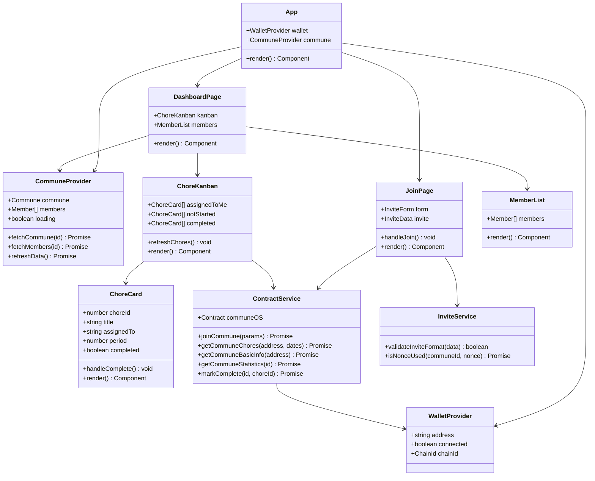
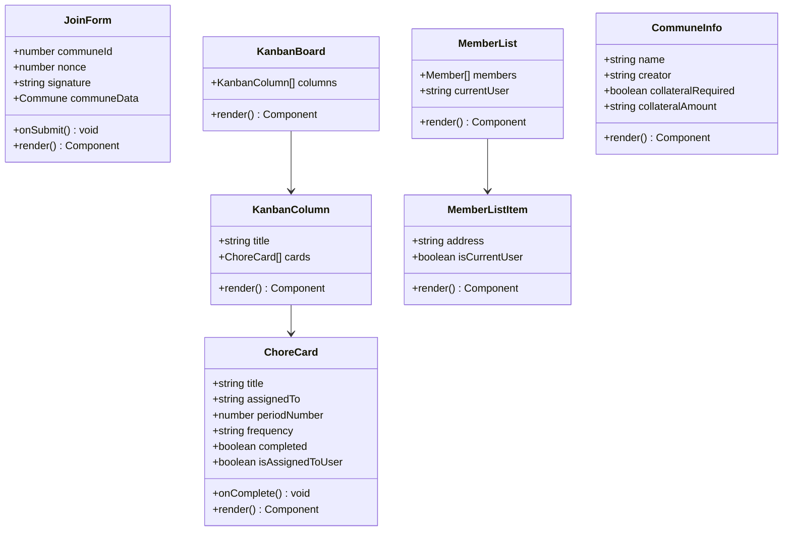
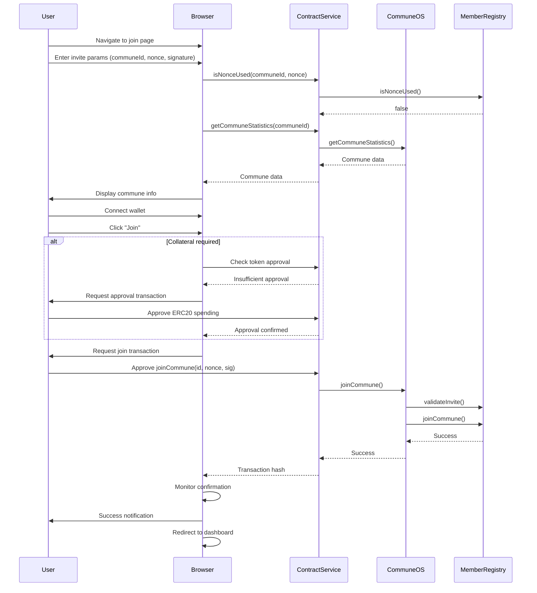
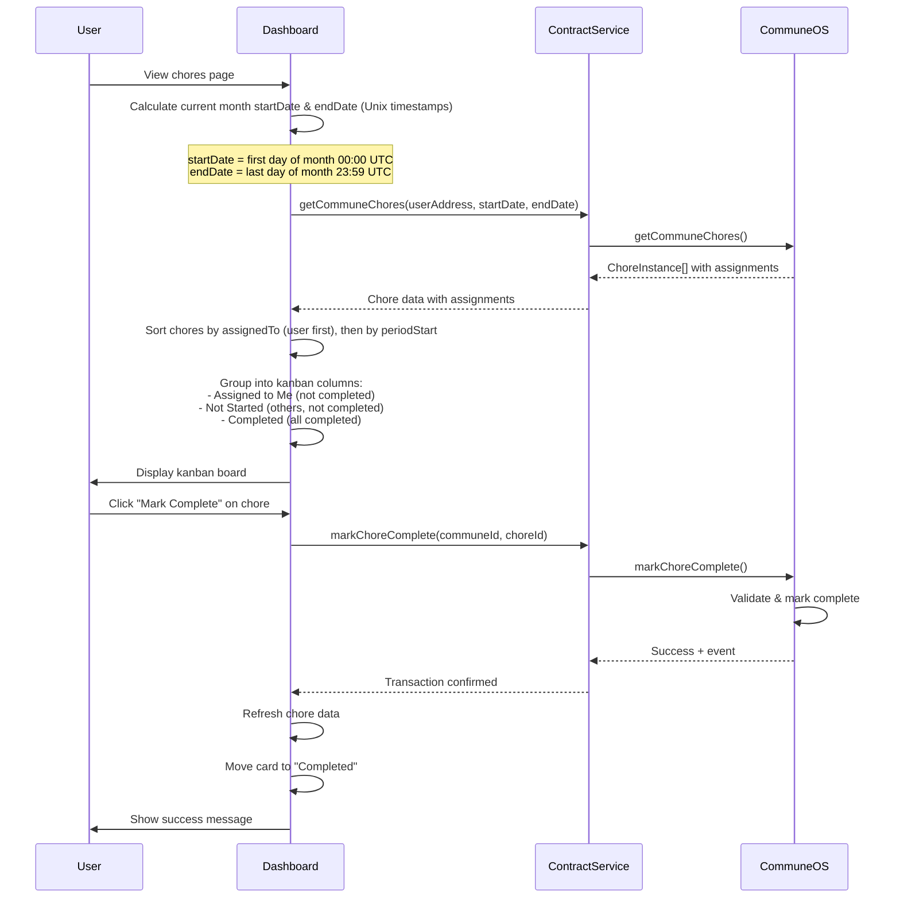
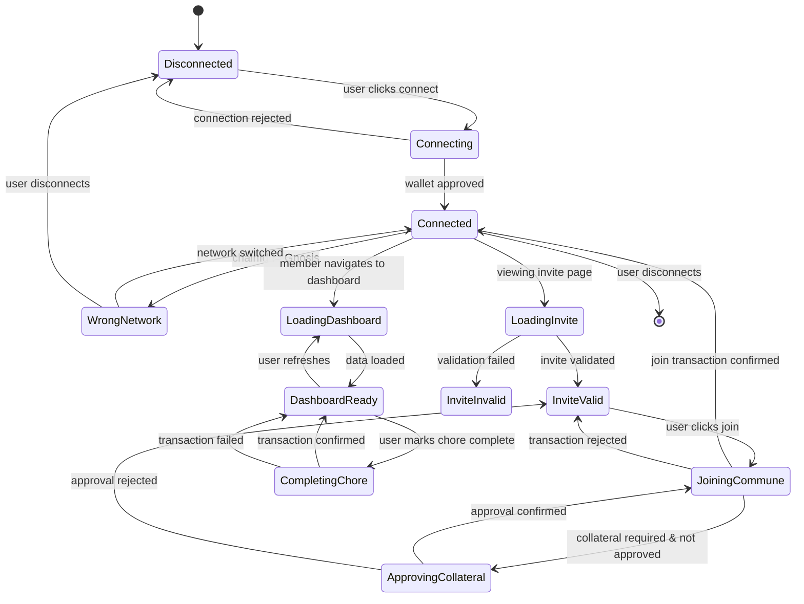

# Frontend Technical Specification - CommuneOS

## 1. Background

### Problem Statement
Communes need a user-friendly interface to manage invite-based member onboarding and rotating chore assignments. Currently, interaction with the smart contracts requires technical blockchain knowledge, making it inaccessible to typical commune residents.

### Context / History
- Smart contract repository: https://github.com/commune-os/commune-os-sc
- Deployed on Gnosis Chain for low gas fees
- Modular architecture with 7 contracts (CommuneOS, CommuneRegistry, MemberRegistry, ChoreScheduler, ExpenseManager, VotingModule, CollateralManager)
- Uses EIP-191 signature verification for secure invite system
- Chores rotate automatically based on period-based scheduling

### Stakeholders
- Commune residents: Need to join communes and track their chore assignments
- Commune creators: Need to invite new members and monitor chore completion
- Smart contract system: Requires proper transaction handling and state synchronization

## 2. Motivation

### Goals & Success Stories

**User Goal 1: Join a Commune**
- User receives invite parameters from commune creator (communeId, nonce, signature)
- User enters invite parameters into join form
- User connects wallet and deposits required collateral (if any)
- User sees confirmation and their commune dashboard

**User Goal 2: View and Complete Chores**
- User sees their current assigned chores on a kanban board
- User understands chore schedule (frequency, rotation) and their assigned period
- User marks chores as complete and sees real-time board updates
- Other members see updated chore status without refresh

**User Goal 3: Monitor Commune Activity**
- User views all commune members
- User sees complete chore history and rotation schedule
- User tracks who is assigned to upcoming chore periods

## 3. Scope and Approaches

### Non-Goals

| Technical Functionality | Reasoning for being off scope | Tradeoffs |
|------------------------|-------------------------------|-----------|
| Expense management UI | Explicitly excluded per requirements | Users must manage expenses through alternative means or wait for future release |
| Commune creation flow | Focus on member experience | Creators use separate admin interface or direct contract interaction |
| Dispute voting interface | Expenses are out of scope | No interface for resolving expense disputes |
| Collateral viewing/withdrawal | Users deposit on join only | No interface to view balance or withdraw collateral |
| Multi-commune membership | Current contracts support one commune per address | Users need multiple wallets for multiple communes |
| Notification system | Real-time alerts not in scope | Users must check app manually for updates |
| Member removal | Off scope for MVP | Cannot remove members once added |
| Manual chore assignment override | Off scope for MVP | All assignments use automatic rotation |
| Accessibility features | Off scope for MVP | WCAG compliance deferred to future iteration |
| Analytics/telemetry | Off scope for MVP | No usage tracking or analytics |
| Error reporting service | Off scope for MVP | Errors logged locally only |

### Value Proposition

| Technical Functionality | Value | Tradeoffs |
|------------------------|-------|-----------|
| Real-time blockchain polling | Users see latest chore/member state | Higher RPC call volume, potential rate limiting |
| Signature-based invites | Secure invite system without on-chain invite registry | Creator must generate and distribute signatures off-chain |
| Kanban board interface | Familiar task management paradigm | May not capture all chore metadata (frequency, rotation) |
| Address-based data fetching | Single contract call fetches all user's commune data with assignments pre-calculated | Simpler frontend logic, reduced RPC calls, automatic commune resolution |

### Alternative Approaches

| Technical Functionality | Pros | Cons |
|------------------------|------|------|
| Indexer/subgraph for state | Fast queries, historical data | Additional infrastructure, sync lag, maintenance overhead |
| Centralized invite server | Easier invite distribution and management | Centralization risk, additional infrastructure |
| Manual state refresh | Simple implementation, no polling overhead | Stale data, poor UX |

### Data Fetching Architecture

The frontend uses **address-based fetching** through CommuneOS viewer methods:

**After Membership (Dashboard/Chore Views):**
- All data fetched by passing `userAddress` to viewer methods
- Single call to `getCommuneChores(userAddress, startDate, endDate)` returns:
  - User's communeId (resolved internally)
  - All chore instances in date range
  - Pre-calculated member assignments
  - Completion status
- Single call to `getCommuneBasicInfo(userAddress)` returns:
  - User's commune data
  - All member addresses

**Before Membership (Join Flow Only):**
- `getCommuneStatistics(communeId)` - Fetches commune details by ID when user has invite but isn't member yet
- `isNonceUsed(communeId, nonce)` - Validates invite before join

**Note on Invite Distribution:**
Invite parameter generation and distribution (communeId, nonce, signature) happens outside the platform by commune creators using off-chain tools.

This architecture eliminates the need for:
- Frontend to track/store communeId
- Multiple RPC calls to fetch related data
- Client-side calculation of chore assignees
- Separate calls to different module contracts

### Relevant Metrics
- Invite conversion rate (invites clicked → members joined)
- Chore completion rate
- Time from chore assignment to completion
- Average session duration
- Transaction success rate

## 4. Step-by-Step Flow

### 4.1 Main ("Happy") Path

#### Flow 1: Joining a Commune

**Pre-condition:** User has received invite parameters (communeId, nonce, signature) from commune creator

1. User navigates to join commune page
2. User enters invite parameters into form (communeId, nonce, signature)
3. System validates invite is not expired/used by calling `memberRegistry.isNonceUsed(communeId, nonce)`
4. System fetches commune details via `communeOS.getCommuneStatistics(communeId)`
5. System displays commune info (name, collateral requirement)
6. User connects wallet
7. User clicks "Join Commune" button
8. If collateral required:
   - System checks if collateralToken is approved for required amount
   - If not approved, system prompts ERC20 approval transaction
   - User approves token spending
9. System initiates `communeOS.joinCommune(communeId, nonce, signature)` transaction
10. User approves transaction
11. System monitors transaction confirmation
12. System displays success message and redirects to commune dashboard

**Post-condition:** User is registered member, collateral deposited (if required), invite nonce marked as used

#### Flow 2: Viewing Chores on Kanban Board

**Pre-condition:** User is connected and is a member of a commune

1. User navigates to chores view
2. System calls `communeOS.getCommuneChores(userAddress, startDate, endDate)` to fetch chore instances
   - `startDate`: beginning of current period (e.g., today 00:00 or start of week)
   - `endDate`: end of current period (e.g., today 23:59 or end of week)
3. System receives `ChoreInstance[]` with pre-calculated assignments and completion status
4. System organizes chores into kanban columns:
   - "Assigned to Me" (assignedTo == userAddress, not completed)
   - "Not Started" (assignedTo != userAddress, not completed)
   - "Completed" (completed == true)
5. System displays each chore card with:
   - Title
   - Assigned member address/ENS
   - Period number
   - Frequency (human-readable, e.g., "Weekly")
   - Completion status
6. User sees real-time board with their assigned chores highlighted

**Post-condition:** User understands current chore assignments and status

#### Flow 3: Completing a Chore

**Pre-condition:** User is viewing kanban board, chore is assigned to them, chore is incomplete

1. User clicks "Mark Complete" on a chore card in "Assigned to Me" column
2. System initiates `communeOS.markChoreComplete(communeId, choreId)` transaction
3. User approves transaction
4. System monitors transaction confirmation
5. On confirmation, system refreshes chore state by calling `communeOS.getCommuneChores(userAddress, startDate, endDate)`
6. System moves chore card to "Completed" column with animation
7. System displays success notification

**Post-condition:** Chore marked complete for current period, board updated

### 4.2 Alternate / Error Paths

| # | Condition | System Action | Suggested Handling |
|---|-----------|---------------|-------------------|
| A1 | Wallet not connected | No wallet address available | Display connection prompt |
| A2 | Invalid invite format | Malformed communeId/nonce/signature | Display "Invalid invite format" error |
| A3 | Invite nonce already used | `isNonceUsed()` returns true | Display "Invite already used or expired" error |
| A4 | Invalid invite signature | `validateInvite()` reverts | Display "Invalid invite" error |
| A5 | Insufficient collateral balance | ERC20 balance check fails | Display "Insufficient balance" with required amount |
| A6 | Transaction rejected by user | User denies transaction | Display "Transaction cancelled" and return to previous state |
| A7 | Transaction reverted | Transaction fails on-chain | Parse revert reason, display user-friendly error, allow retry |
| A8 | User already member of a commune | `joinCommune()` reverts with AlreadyRegistered | Display "You are already a member of another commune" |
| A9 | No assigned chores | `getCommuneChores()` returns empty array | Display empty state with "No chores yet" message |
| A10 | User marks non-assigned chore complete | Permission violation (not enforced by contract modifier, but illogical) | Disable "Mark Complete" button on chores not assigned to user |
| A11 | Chore already completed | `markChoreComplete()` reverts with AlreadyCompleted | Display "Chore already completed" error |

## 5. UML Diagrams

### 5.1 Component Class Diagram

### 5.2 Graphic Component Class Diagram

### 5.3 Join Commune Sequence Diagram

### 5.4 Chore Completion Sequence Diagram

### 5.5 Frontend State Machine

## 6. Edge Cases and Concessions

### Edge Cases Not Fully Accounted For

1. **Timezone Display**: All timestamps calculated and displayed in UTC. User's local timezone not considered.

2. **Historical Chore Data**: Default view shows current month only. Historical chore view possible by adjusting date range parameters in `getCommuneChores()`.

### Design Decisions and Compromises

1. **Polling vs. Websockets**: Using interval polling (every 10s) instead of WebSocket subscriptions for simplicity. May show stale data briefly.

2. **No Subgraph**: Querying full state from RPC instead of indexed data. Slower initial load but no indexer infrastructure dependency.

3. **Current Month Date Range**: Frontend queries chores for current month only (first day 00:00 UTC to last day 23:59 UTC). Historical views deferred.

4. **Single Commune Per User**: UI assumes one commune per wallet address per contract constraints. All viewer methods use `address` to automatically fetch the user's commune data.

5. **Minimal Chore Metadata**: Only displaying title, frequency, and assigned member. No description, tags, or priority fields.

6. **No Member Profiles**: Members identified only by wallet address. No names, avatars, or additional profile information.

7. **Basic Kanban**: Three fixed columns (Assigned to Me, Not Started, Completed). No custom columns, drag-and-drop reordering, or filters.

8. **No Chore Creation UI**: Members can only view/complete chores. Creating new chores requires separate admin interface or contract interaction.

9. **Fixed Token Decimals**: All collateral amounts assumed to be 18 decimals (1e18). No dynamic decimal querying from token contracts.

## 7. Open Questions

1. **Collateral Token Symbol**: How to display collateral token symbol in the UI? Query token contract for symbol or hardcode based on deployment?

2. **Date Range Navigation**: Should users be able to navigate to previous/future months for chore history, or strictly current month only for MVP?

3. **Empty Commune State**: What should be displayed when a user joins a commune with no chores defined yet? Empty state with instructions?

4. **Transaction Confirmation Wait Time**: How many block confirmations should we wait for before considering a transaction final and updating UI?

## 8. Glossary / References

### Terms

- **Commune** - A group living arrangement with shared responsibilities, represented on-chain
- **Chore** - A recurring task assigned to members on a rotating schedule
- **Period** - A time window for a chore, calculated as `(currentTime - startTime) / frequency`
- **Nonce** - A unique number used once to prevent replay attacks in invite signatures
- **Collateral** - ERC20 tokens or ETH deposited by members, subject to slashing for disputes (expense-related, out of scope)
- **EIP-191** - Ethereum standard for signed message format
- **Kanban** - Visual task management system with columns representing workflow stages

### Smart Contract Interfaces

**CommuneOS** (Main entry point - all frontend calls go through this contract)
- `joinCommune(uint256 communeId, uint256 nonce, bytes signature)` - Join commune with invite
- `markChoreComplete(uint256 communeId, uint256 choreId)` - Complete a chore
- `getCommuneStatistics(uint256 communeId)` - Get commune info by ID (for invite flow before membership)
- `getCommuneBasicInfo(address user)` - Get user's commune info and members
- `getCommuneChores(address user, uint256 startDate, uint256 endDate)` - Get chore instances with pre-calculated assignments for date range

**MemberRegistry** (only for validation during join flow)
- `isNonceUsed(uint256 communeId, uint256 nonce)` - Check if invite nonce used
- `memberCommuneId(address user)` - Get communeId for a user (used internally by viewer methods)

### Links

- **Smart Contract Repository**: https://github.com/commune-os/commune-os-sc
- **Gnosis Chain Documentation**: https://docs.gnosischain.com/
- **EIP-191 Specification**: https://eips.ethereum.org/EIPS/eip-191
- **Foundry Documentation**: https://book.getfoundry.sh/
- **Contract Deployment**: Automated via GitHub Actions to Gnosis Chain (main branch) and Holesky testnet (PRs)
