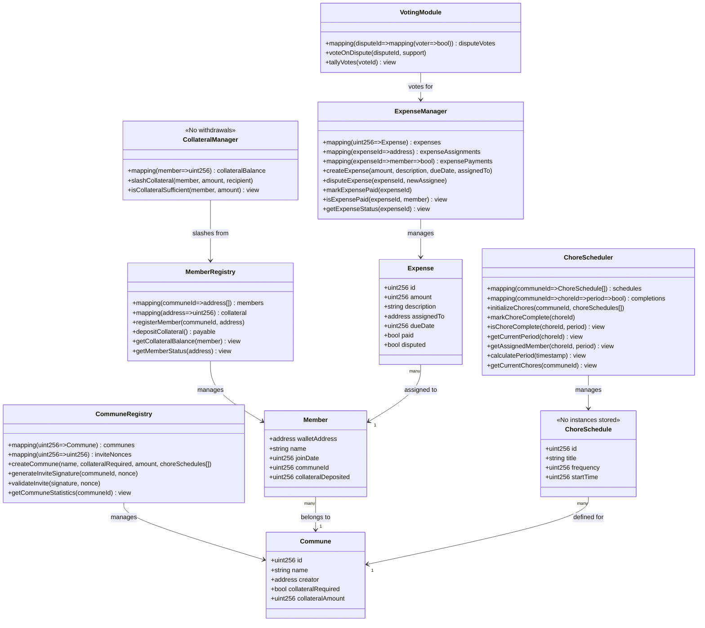
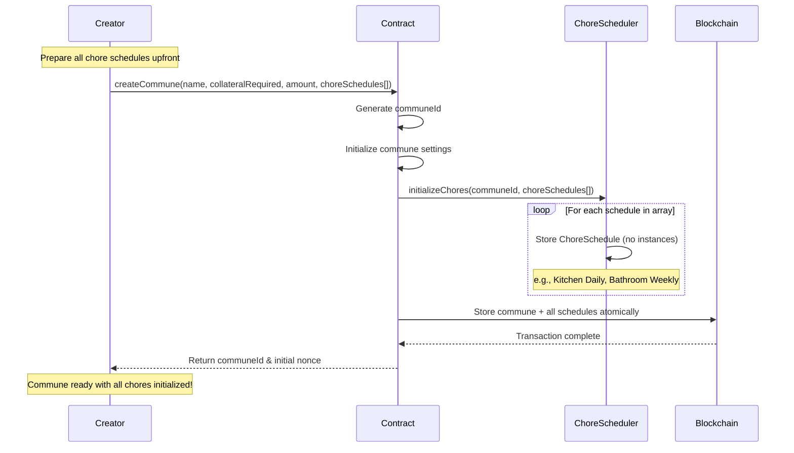
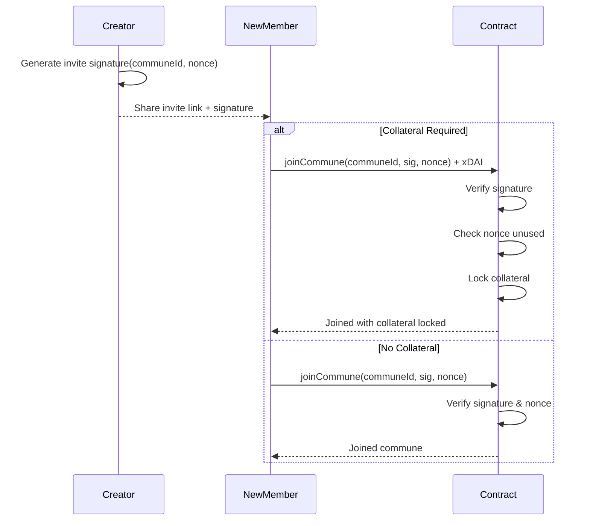
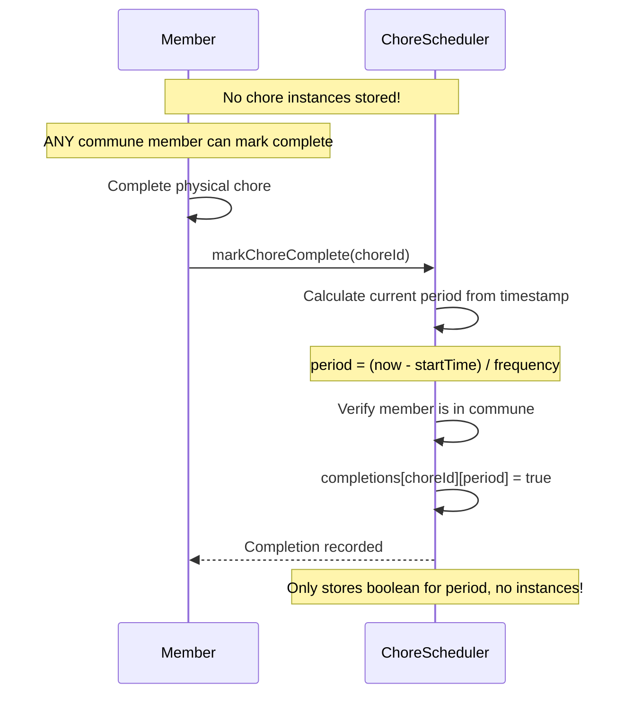
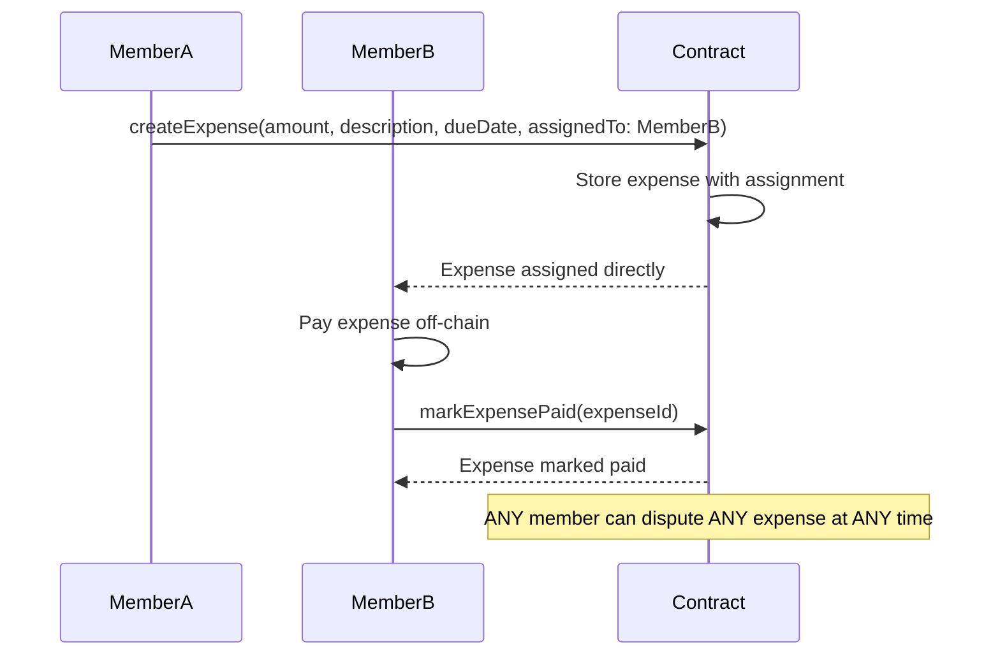
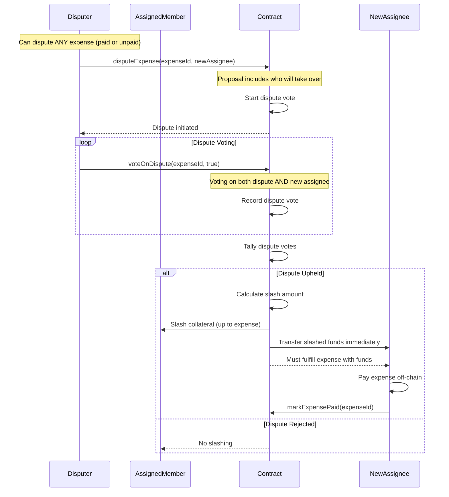
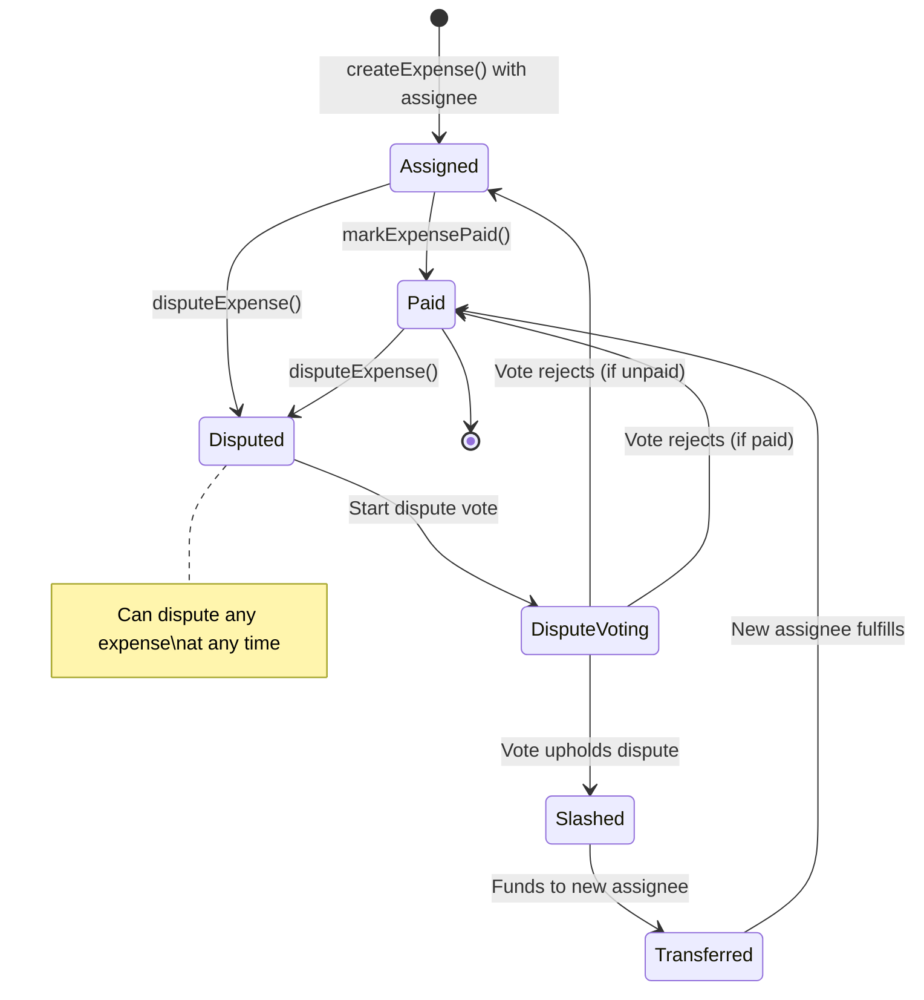
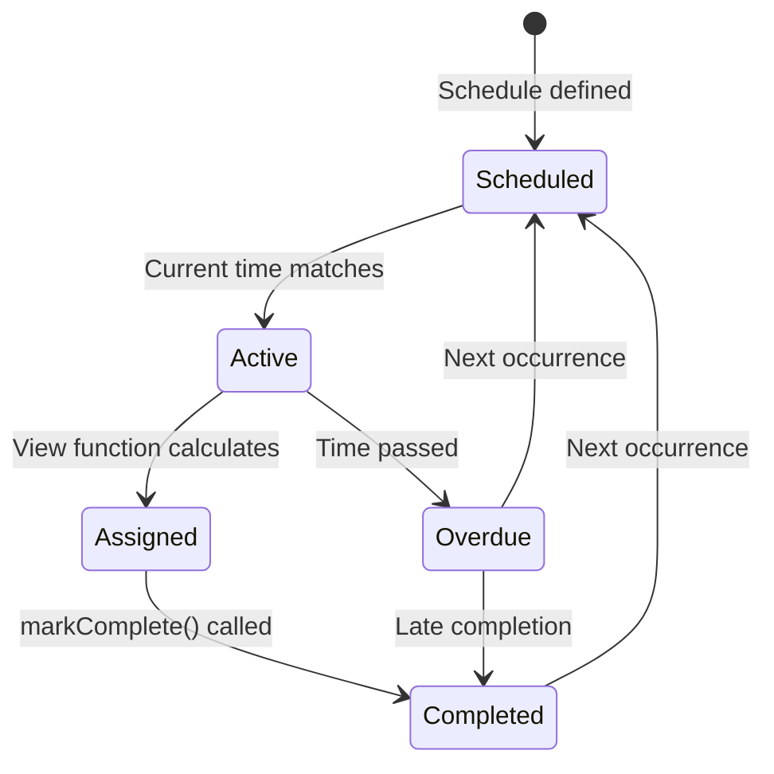

# Technical Spec: CommuneOS Smart Contracts

## 1. Background

### Problem Statement
The core challenge of commune living is establishing trust between strangers who must share resources and responsibilities. Traditional methods fail because they lack transparent, immutable record keeping of obligations and completions. Smart contracts provide a tamper-proof ledger for tracking commune activities, creating accountability through transparency rather than financial enforcement.

### Context / History
- Growing interest in communal living and co-housing arrangements
- Existing solutions rely on manual tracking or generic task apps not designed for communes
- Lack of transparent, verifiable record keeping for shared responsibilities
- Blockchain provides immutable record keeping to create accountability through transparency
- Smart contracts serve as the source of truth for commune obligations and completions

### Stakeholders
- **Primary Users**: Commune members (residents of shared living spaces)
- **Secondary Users**: Commune administrators, potential new members
- **External Systems**: Gnosis Chain (formerly xDai), wallet applications with recovery features

## 2. Motivation

### Smart Contract Goals

**Core Objectives:**
- Provide immutable record keeping for chore completions and expenses
- Enable transparent chore scheduling and expense assignment
- Create invite-only communes with optional collateralization
- Track task completions and expense payments through mappings
- Enable direct expense assignment with dispute resolution
- Maintain minimal on-chain state for gas efficiency on Gnosis Chain

**Smart Contract Functionality:**
- Invite-only member registration with optional collateral deposit
- Chore schedule definition with timestamp-based recurrence
- Expense creation and direct assignment to members
- Collateral management and slashing mechanism
- View functions to calculate current chores from schedule
- Simple completion mapping (choreId => member => timestamp)
- Expense payment tracking and dispute resolution
- Collateral redistribution for unfulfilled expenses
- Minimal state storage optimized for Gnosis Chain

## 3. Scope and Approaches

### Non-Goals

| Technical Functionality | Reasoning for being off scope | Tradeoffs |
|------------------------|-------------------------------|-----------|
| Frontend implementation | This spec covers smart contracts only | UI/UX handled separately |
| Off-chain data storage | Only chore completions stored on-chain | Minimal gas usage on Gnosis |
| Cross-commune interactions | Focus on single commune contracts | No inter-commune features |
| Member departure | Out of scope for MVP | Manual process off-chain |

### Value Proposition

| Technical Functionality | Value | Tradeoffs |
|----------------------|-------|------------|
| Immutable record keeping | Creates accountability through transparency | Requires blockchain interaction |
| Gnosis Chain deployment | Very low gas fees (~$0.01/tx) | Depends on Gnosis Chain reliability |
| Invite-only access | Secure commune membership | Requires signature verification |
| View-based chores | No storage for individual chore instances | Computation on each query |
| Optional collateralization | Enables expense enforcement | Requires xDAI deposit |
| Direct expense assignment | Fast allocation without voting | Creator decides assignments |

### Alternative Smart Contract Approaches

| Technical Approach | Pros | Cons |
|-------------------|------|------|
| Store chore instances | Direct queries | High storage costs (our design avoids this) |
| View function calculation | Zero instance storage | Computation on each call (our design) |
| Full on-chain payments | Automatic settlement | High complexity |
| Hybrid collateral model | Flexible enforcement | More complex logic |
| Time-locked deposits | Prevents quick exit scams | Reduces liquidity |

### Key Tracking Points
- Chore schedules stored once (never instances)
- Chore completions via period-based mapping
- Period calculation: (timestamp - startTime) / frequency
- Expense assignments and payment status
- Collateral deposits and slashing history
- Voting participation on expenses and disputes
- Member participation through completion records
- Commune activity via event logs

## 4. Step-by-Step Flow

### 4.1 Main ("Happy") Path

**Member Registration via Invite (Smart Contract):**
1. **Pre-condition**: Valid invite signature from commune creator
2. **Function Call**: joinCommune(communeId, signature, nonce) with xDAI if required
3. **Contract validates**: Signature valid, nonce unused, collateral sufficient
4. **State Update**: Add member, lock collateral if required, mark nonce used
5. **Event Emission**: MemberJoined(address, communeId, collateral, timestamp)
6. **Post-condition**: Member registered with collateral deposited if required

**Expense Assignment and Payment Flow:**
1. **Pre-condition**: Commune member wants to create an expense
2. **Direct Assignment**: Member calls createExpense(amount, description, dueDate, assignedTo)
3. **State Update**: Expense created and assigned to specified member immediately
4. **Payment**: Assigned member pays off-chain, calls markExpensePaid()
5. **Dispute Option**: ANY member can dispute ANY expense at ANY time (paid or unpaid)
6. **Dispute Proposal**: disputeExpense(expenseId, newAssigneeAddress)
7. **Dispute Vote**: Members vote on BOTH dispute validity AND new assignee
8. **Slashing**: If dispute upheld, slash collateral up to expense amount
9. **Direct Transfer**: Slashed funds immediately sent to approved new assignee
10. **Post-condition**: New assignee must fulfill expense with received funds

**Chore Completion Flow (No Instance Storage):**
1. **Pre-condition**: ChoreSchedules initialized at commune creation
2. **Physical Action**: Member completes actual chore
3. **Contract Call**: ANY commune member calls markChoreComplete(choreId)
4. **Period Calculation**: Contract calculates period = (now - startTime) / frequency
5. **State Update**: Set completions[choreId][period] = true
6. **Event Emission**: ChoreCompleted(choreId, period)
7. **Post-condition**: Only completion boolean stored (no instances or member tracking)

### 4.2 Alternate / Error Paths

| # | Condition | System Action | Suggested Handling |
|---|-----------|---------------|-------------------|
| A1 | Invalid invite signature | Reject join attempt | Request new invite |
| A2 | Nonce already used | Reject join attempt | Request new invite |
| A3 | Insufficient collateral | Reject join attempt | Require xDAI deposit |
| A4 | Chore already completed | Reject duplicate | Return existing timestamp |
| A5 | Member not in commune | Reject action | Require valid membership |
| A6 | Expense dispute upheld | Slash and transfer | Funds go to voter-approved new assignee |
| A7 | Collateral insufficient for expense | Partial slash only | Slash maximum available |
| A8 | Dispute on paid expense | Process dispute vote | Can dispute any expense anytime |

## 5. UML Diagrams

### Class Diagram

### Sequence Diagram - Commune Creation

### Sequence Diagram - Member Joining

### Sequence Diagram - Chore Completion Flow

### Sequence Diagram - Expense Creation & Assignment

### Sequence Diagram - Expense Dispute & Slashing

### State Diagram - Expense Lifecycle

### State Diagram - Chore Lifecycle

## 6. Edge Cases and Concessions

### Edge Cases Not Fully Accounted For
- **Dispute resolution**: Complex disputes beyond binary paid/not-paid
- **Chore modifications**: Changing schedules requires commune consensus
- **Multiple completions**: Same chore marked complete by multiple members
- **Permanent collateral**: Once deposited, collateral remains locked for commune accountability
- **Vote manipulation**: Small communes vulnerable to collusion
- **Dispute without new assignee**: Disputer should propose themselves or willing member
- **New assignee doesn't fulfill**: Could trigger another dispute cycle

### Design Decisions and Compromises
- **Gnosis Chain deployment**: Very low gas fees (~$0.01/tx) enable frequent interactions
- **Optional collateralization**: Communes choose whether to require deposits
- **Permanent collateral**: No withdrawal mechanism - ensures long-term accountability
- **No-instance chore design**: Store schedules only, calculate instances via math
- **Invite-only model**: Communes are private by design
- **Simple voting**: Basic majority for expense decisions
- **Partial slashing**: Can only slash up to expense amount or available collateral
- **Single commune focus**: No inter-commune features in MVP

### Off-Scope Items
- Integration with external calendar apps
- Automated chore scheduling based on preferences
- Machine learning for optimal task distribution
- Cross-chain token support
- Fiat on/off ramps

## 6.1 Feature Categories and Types

### Chore Management (Smart Contract)
- **No Instance Storage**: Never create or store individual chore occurrences
- **Chore Schedules**: ONE stored schedule per chore type (e.g., one "Kitchen Cleaning" entry)
- **Period Calculation**: Current period = (now - startTime) / frequency
- **Completion Mapping**: choreId => periodNumber => bool (any member can mark complete)
- **Assignment Logic**: Rotation index calculated from period number
- **View Functions**: Calculate current chores on-demand from schedule + math
- **Storage Efficiency**: 
  - Traditional: Store "Kitchen Monday", "Kitchen Tuesday", etc. = Unbounded growth
  - Our Design: Store ONE "Kitchen Daily" schedule = O(1) storage forever

### Contract State Variables
- **Communes**: Mapping of commune ID to settings (creator, nonce, collateralRequired, collateralAmount)
- **Members**: Mapping of commune ID to member addresses  
- **Collateral**: Mapping of member to deposited amount
- **ChoreSchedules**: Array of chore schedule structs per commune (NOT instances)
- **ChoreCompletions**: Nested mapping (communeId => choreId => periodNumber => bool) in ChoreScheduler
- **Expenses**: Array of expense records per commune
- **ExpenseAssignments**: Mapping of expense ID to assigned member  
- **ExpensePayments**: Mapping (expenseId => member => paid) in ExpenseManager
- **DisputeVotes**: Nested mapping for voting on disputes only
- **InviteNonces**: Used nonces for invite signatures

### Smart Contract Modules
- **CommuneRegistry**: Creates communes with invite links and initial chore schedules, manages commune statistics
- **MemberRegistry**: Manages member addresses, collateral deposits, and member status views
- **ChoreScheduler**: Stores chore schedules initialized at commune creation, tracks completions, and calculates current chores
- **ExpenseManager**: Handles expense lifecycle including creation, direct assignment, payments, disputes, and status queries
- **VotingModule**: Manages votes for disputes only (no voting for assignment)
- **CollateralManager**: Controls deposits and slashing (no withdrawals)

## 7. Open Questions

### Technical Questions
- Best practices for Gnosis Chain deployment?
- Optimal signature scheme for invite links?
- Best practice for timestamp validation?
- How to handle timezone differences in schedules?

## 8. Glossary / References

### Terms
- **Gnosis Chain**: EVM-compatible sidechain with stable low fees (formerly xDai)
- **xDAI**: Native token of Gnosis Chain, pegged 1:1 to USD
- **Collateral**: Permanent xDAI deposit required to join communes (non-withdrawable)
- **Slashing**: Deduction from collateral for unpaid expenses, funds transferred to voter-approved new assignee
- **Expense Assignment**: Direct allocation of expense responsibility to a member
- **Expense Dispute**: Process where ANY member can challenge ANY expense at ANY time
- **Nonced Signature**: Cryptographic signature with unique identifier to prevent replay
- **View Function**: Read-only function that computes data without gas costs
- **Timestamp-based**: Using Unix timestamps instead of block numbers for timing

### Links
- [Web3 Integration Best Practices](https://docs.metamask.io/guide/)
- [Smart Contract Security Guidelines](https://consensys.github.io/smart-contract-best-practices/)
- [DAO Governance Patterns](https://docs.governor.eth)
- [Token Economics Design](https://tokenomics.xyz)
- [Commune Living Research](https://www.ic.org/resources/)
- [Decentralized Identity Standards](https://www.w3.org/TR/did-core/)

### Internal Documentation
- Smart Contract Language: Solidity 0.8.x
- Network: Gnosis Chain (ChainID: 100)
- Native Token: xDAI (stable, pegged to USD)
- Signature Standard: EIP-712 for invite signatures
- Time Management: Unix timestamps for all scheduling
- Access Control: Simple member/creator checks
- Gas Optimization: Minimal storage, view function calculations
- Event System: Events for joins and completions only
- Testing Framework: Hardhat with Gnosis Chain fork
- RPC Endpoint: https://rpc.gnosischain.com
