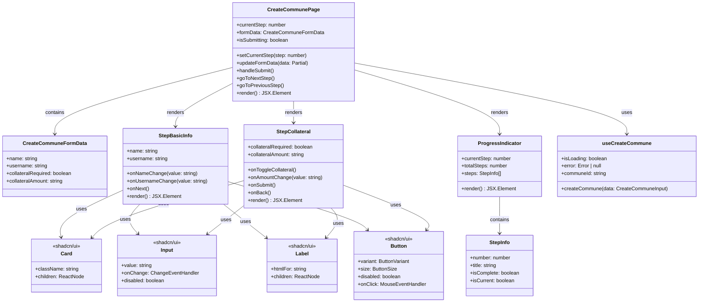
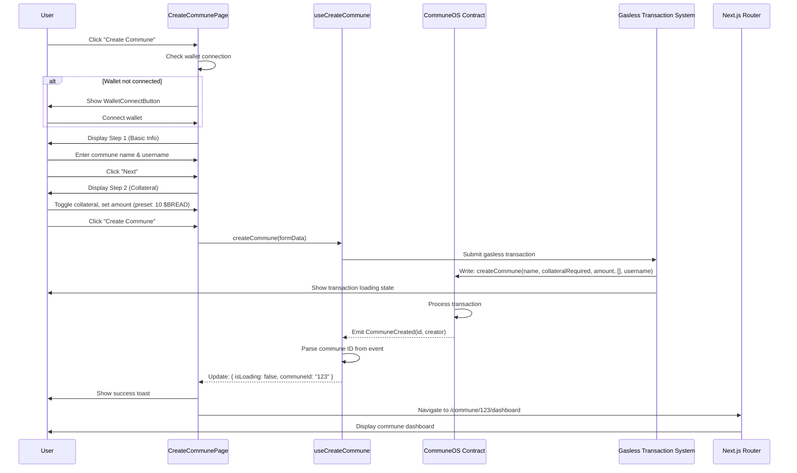
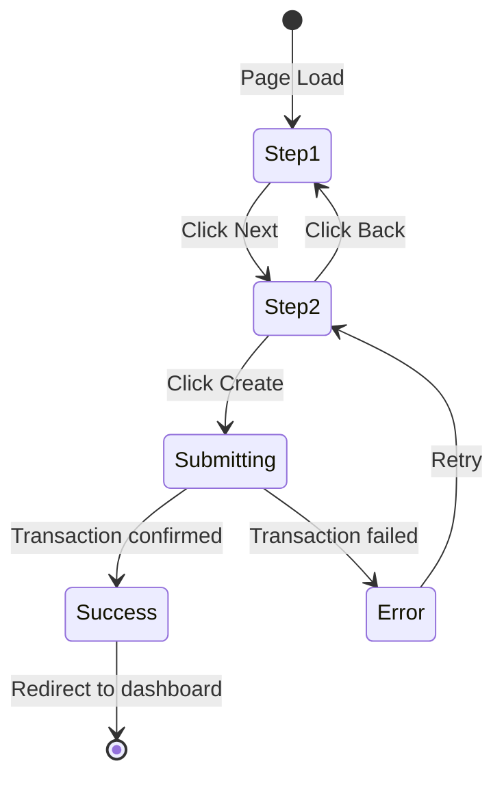
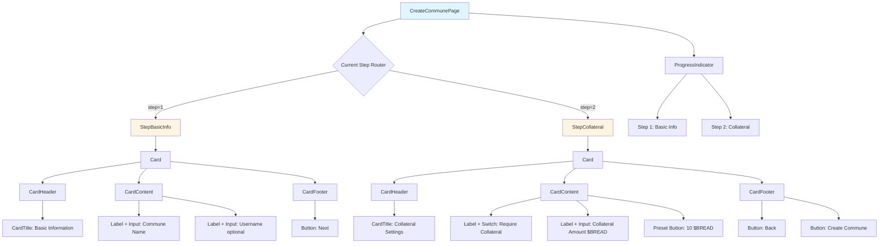

# Technical Spec: Commune Creation Page

## 1. Background

### Problem Statement
Users currently lack a streamlined interface to create new communes in the ShareHouse app. The commune creation process needs to be simple, intuitive, and integrate seamlessly with the existing blockchain infrastructure on Gnosis Chain with gasless transactions.

### Context / History
- Existing join flow (`/app/join/page.tsx`) demonstrates wallet-connected flows
- Current form patterns in codebase use native React state with dialog-based UI
- Gasless transactions already implemented (no gas fees for users)
- Transaction status tracking infrastructure already exists
- Invite link feature handles member addition (no manual address entry needed)
- Type definitions already exist in `/types/commune.ts` for Commune entity
- Collateral system uses $BREAD token (0xa555d5344f6fb6c65da19e403cb4c1ec4a1a5ee3)
- Chore schedules are configured in a separate step after commune creation

### Stakeholders
- **Primary Users:** Commune creators (house organizers, community leaders)
- **Technical Systems:**
  - Gnosis Chain smart contracts (CommuneOS contract)
  - Next.js 15 frontend with React 19
  - Web3 infrastructure (wagmi, viem, Privy) with gasless transactions
  - Existing dashboard and chore management systems

---

## 2. Motivation

### Goals & Success Stories

**User Goals:**
1. **Quick Creation:** User can create a commune in under 60 seconds
2. **Simple Configuration:** Essential fields only (name, username, collateral)
3. **Immediate Access:** Upon creation, user is redirected to their new commune dashboard
4. **Clear Feedback:** User receives confirmation via existing toast system

**Technical Goals:**
1. Follow existing codebase patterns (native React forms, shadcn/ui components)
2. Integrate with gasless transaction infrastructure
3. Maintain type safety with TypeScript throughout
4. Support mobile-responsive design with Tailwind CSS
5. Use existing transaction handling and toast notification systems

**Success Story:**
> Sarah wants to create a commune for her shared house. She connects her wallet, enters "Maple Street House" as the name and "Sarah" as her username. She toggles on collateral requirement and uses the preset of 10 $BREAD. Within 30 seconds, the gasless transaction confirms and she's viewing her new commune dashboard.

---

## 3. Scope and Approaches

### Non-Goals

| Technical Functionality | Reasoning for being off scope | Tradeoffs |
|------------------------|-------------------------------|-----------|
| Chore schedules during creation | Configured in separate step after creation | Simplifies creation flow; two-step process |
| Commune description field | Not essential for MVP | Can be added in settings later if needed |
| Commune templates (e.g., "Student House", "Co-op") | Not enough usage data to know which templates are needed | Custom configuration only; templates can be added later |
| Image/avatar upload for commune | No IPFS/storage infrastructure in current stack | Text-based identification only |
| Editing commune name/collateral after creation | Immutable by design | Clear expectations; prevents confusion |

### Value Proposition

| Technical Functionality | Value | Tradeoffs |
|------------------------|-------|-----------|
| Simple two-step form | Fast creation; minimal cognitive load | Streamlined to essential fields only |
| Gasless transactions | Zero friction; no gas fees | Already implemented |
| $BREAD collateral with toggle | Easy to understand; optional for flexible communes | Collateral amount only relevant when toggled on |
| Collateral preset (10 $BREAD) | Quick selection; no typing required | Less flexibility but faster UX |
| Username field | Personalization from start | Optional field, creator can skip |
| Existing transaction handling | Consistent UX; reliable infrastructure | No additional implementation needed |

### Alternative Approaches

| Approach | Pros | Cons |
|----------|------|------|
| **A: Simple two-step form (CHOSEN)** | Fast, minimal friction, easy to understand | Less configuration options |
| **B: Single-page form** | Fewer clicks; all fields visible at once | Less guided; harder to focus |
| **C: Dialog-based creation from dashboard** | Follows create-expense pattern; no new route needed | Limited space for future expansion |

**Decision:** Simple two-step form approach (A) provides best balance of speed and clarity.

### Relevant Metrics

- **Creation completion rate:** % of users who start creation and complete transaction
- **Time to creation:** Median time from "Create Commune" click to successful transaction
- **Transaction failure rate:** % of failed blockchain transactions
- **Mobile vs desktop usage:** Device breakdown to inform responsive design priorities

---

## 4. Step-by-Step Flow

### 4.1 Main ("Happy") Path

**Pre-condition:**
- User is authenticated with wallet connected via Privy/Web3Modal
- User is on `/dashboard` or landing page

**Flow:**

1. **User** clicks "Create Commune" button (new button on dashboard or landing page)

2. **System** navigates to `/create-commune` route

3. **System** checks wallet connection status
   - If not connected: Display wallet connect prompt
   - If connected: Proceed to Step 1

4. **User** completes Step 1: Basic Information
   - Input: Commune name (required)
   - Input: Username (optional)
   - Click "Next"

5. **System** proceeds to Step 2

6. **User** completes Step 2: Collateral Configuration
   - Toggle: Require collateral? (yes/no)
   - If yes: Input collateral amount in $BREAD (default preset: 10 $BREAD)
   - Click "Create Commune"

7. **System** initiates gasless blockchain transaction
   - Calls `createCommune()` contract function
   - Parameters: name, collateralRequired, collateralAmount, choreSchedules[] (empty array), username
   - Existing transaction handling shows loading state

8. **System** waits for transaction confirmation (handled by existing infrastructure)
   - Transaction completes via gasless transaction system
   - Captures: New commune ID from event logs

9. **System** shows success feedback
   - Toast: "Commune created successfully!"

10. **System** redirects to `/commune/[communeId]/dashboard`

**Post-condition:**
- New commune exists on-chain with unique ID
- Creator is registered as first member
- User is viewing their new commune dashboard
- User can now add chores in a separate step

---

### 4.2 Alternate / Error Paths

| # | Condition | System Action | Suggested Handling |
|---|-----------|---------------|-------------------|
| **A1** | Wallet not connected at start | Display wallet connect button; block form access | Show WalletConnectButton component with "Connect wallet to create commune" message |
| **A2** | User disconnects wallet mid-flow | Pause form; show reconnection prompt | Preserve form state; allow reconnection |
| **A3** | User rejects transaction | Transaction cancelled; stay on form | Show toast "Transaction cancelled"; keep form data; allow retry |
| **A4** | Transaction fails (revert) | Catch error; show error message | Toast: "Transaction failed: [reason]"; allow retry; preserve form state |
| **A5** | Contract error | Transaction reverts with error message | Parse revert reason; show user-friendly message |
| **A6** | Commune ID not found in event logs | Transaction succeeded but ID not captured | Poll contract for recent communes by creator address |
| **A7** | Network switch during transaction | Transaction submitted to wrong chain | Lock chain selector during transaction (wagmi handles this) |

---

## 5. UML Diagrams

### 5.1 Component Class Diagram

---

### 5.2 User Flow Sequence Diagram

---

### 5.3 State Machine Diagram

---

### 5.4 Component Hierarchy Diagram

---

## 6. Edge Cases and Concessions

### Edge Cases Not Fully Accounted For

1. **User creates commune with same name as existing**
   - Risk: May confuse users if names aren't unique
   - Mitigation: Display commune ID prominently; contract doesn't enforce uniqueness
   - Future: Add optional uniqueness check with warning

2. **Network switch during transaction**
   - Risk: Transaction submitted to wrong chain
   - Mitigation: Lock chain selector during transaction; wagmi handles this
   - Future: Add explicit chain validation before submission

3. **Collateral enabled but amount is zero or empty**
   - Risk: Invalid configuration
   - Mitigation: Disable "Create Commune" button if collateral required but amount is 0 or empty

### Design Decisions That Compromise Full Behavior

1. **No commune description field**
   - Decision: Only name, username, collateral, and chores
   - Reason: Simplifies MVP; descriptions can be added to settings later
   - Impact: Less context for commune identification

3. **No editing after creation**
   - Decision: Commune name and collateral are immutable
   - Reason: Prevents confusion and maintains contract integrity
   - Impact: Users must be careful during creation; can be documented clearly

4. **No chore schedules during creation**
   - Decision: Chores are configured in a separate step after commune creation
   - Reason: Simplifies creation flow; two-step onboarding process
   - Impact: Users must complete creation first, then add chores
   - Contract parameter: Empty array `[]` passed to `choreSchedules`

### Concessions for MVP

1. **Mobile UX is functional but not optimized**
   - Full responsive design, but desktop-first
   - Input fields use standard mobile keyboard
   - Acceptable for MVP given expected desktop-heavy usage

2. **Error messages may include technical details**
   - Some error messages will show raw contract revert reasons
   - Not all errors have user-friendly translations
   - Acceptable for MVP with technical early adopters

---

## 7. Open Questions

### Answered Questions

1. ~~**Should we allow editing commune name/collateral after creation?**~~
   - **Answer:** No. Commune name and collateral are immutable after creation (documented in Design Decisions section)

2. ~~**Should collateral be per-member or per-commune?**~~
   - **Answer:** Collateral is system-wide and commune-wide, not per-member. USD-based.

3. ~~**Do we need a "Cancel" button that clears all progress?**~~
   - **Answer:** No cancel button needed.

4. ~~**Should we show estimated time to completion?**~~
   - **Answer:** No estimated time to completion.

5. ~~**Should we integrate with Gnosis Safe for multi-sig communes?**~~
   - **Answer:** No. Out of scope.

6. ~~**Do we need to support creating communes on multiple chains?**~~
   - **Answer:** No. Gnosis Chain only.

1. ~~**What is the minimum/maximum collateral amount?**~~
   - **Answer:** No min/max limits. Free-form input with preset option.

2. ~~**Should collateral amount have preset options?**~~
   - **Answer:** Yes. Preset is 10 $BREAD (token address: 0xa555d5344f6fb6c65da19e403cb4c1ec4a1a5ee3)

4. **Should the collateral input show token symbol ($BREAD) or full name?**
   - Impact: User understanding of what they're depositing
    - Answer: Just show it as dollars they dont need to understand anything else 

---

## Existing Components to Reuse

From `/components/ui`:
- Card, CardHeader, CardTitle, CardDescription, CardContent, CardFooter
- Input
- Label
- Button
- Switch (for collateral toggle)
- Toast (via useToast hook)

From `/components`:
- WalletConnectButton (for wallet connection check)

---

**End of Specification**
